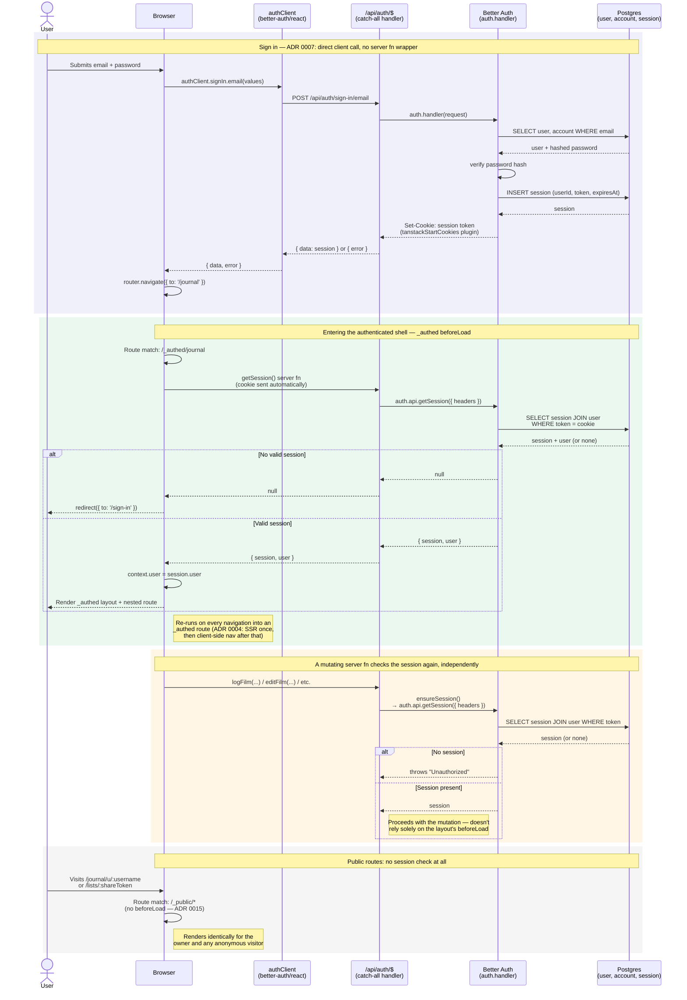

# Sequence: Auth & session

Four things in one diagram, because they only make sense in contrast to each other:
signing in (`src/routes/sign-in.tsx`), entering the authenticated shell
(`_authed.tsx`'s `beforeLoad`), a mutating server function re-checking the session on
its own (`ensureSession`, `src/lib/auth/functions.ts`), and a public route that skips
the check entirely (`_public.tsx`).

## Notes

- **Sign in and register bypass server functions entirely** (ADR 0007): the form calls
  `authClient.signIn.email` / `authClient.signUp.email` directly, which hits the
  `/api/auth/$` catch-all route that just forwards every request to `auth.handler`.
  This is the path Better Auth's `tanstackStartCookies` plugin is built for — it gives
  the submit handler a synchronous `{ data, error }` result without an extra hop
  through a TanStack Start server function.
- **The session cookie is the only thing carried forward.** Nothing about "is this
  user signed in" is cached in the client — every subsequent check re-reads the cookie
  and re-queries `session`/`user` from Postgres.
- **Two independent checkpoints, not one.** `_authed`'s `beforeLoad` guards page
  _navigation_ (redirects to `/sign-in`); each mutating server function calls
  `ensureSession()` itself and throws if there's no session. A request that somehow
  reached a server function without passing through the layout (e.g. a direct call)
  still can't mutate data unauthenticated.
- **`_public` routes are the deliberate exception**: no `beforeLoad`, no session
  lookup at all — List share links and the Public Journal render identically for the
  owner and any anonymous visitor by design (ADR 0015). Owner-aware affordances on
  these pages are explicitly out of scope for now.
- **SSR-once-then-CSR** (ADR 0004) means the `beforeLoad` session check happens
  server-side on first load, then again as a client-to-server server-function call on
  every later in-app navigation — it's a real network round trip each time, not a
  one-off gate.
