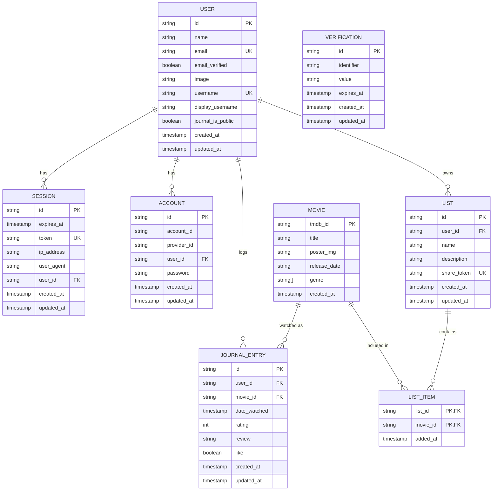

# Entity Relationship Diagram

Schema as defined in `src/lib/db/schema/*`. `user`/`session`/`account`/`verification`
are Better Auth's core tables (ADR 0003), extended with `username`/`journalIsPublic`
for the username plugin (ADR 0014). `movie` is an immutable TMDB cache shared by
`journal_entry` and `list_item` — split out per ADR 0001 specifically so a `Movie` can
be referenced from both without duplicating catalog data.

## Notes

- **`user` ↔ `session`/`account`**: Better Auth's own tables, both cascade-delete on
  `user`. `verification` is identifier-keyed (typically email), not user-scoped, so it
  carries no FK to `user`.
- **`movie` is immutable and append-only** (ADR 0001, ADR 0005): written once when a
  user first logs or lists a film, keyed by TMDB id, never updated. `genre` is the one
  cached field beyond the summary set, added specifically to support server-side
  Journal filtering (ADR 0012).
- **`journal_entry`**: a user's personal watch record. Multiple entries per
  `(user, movie)` pair are allowed — rewatches — so there's no uniqueness constraint
  across those columns. Deleting an entry never deletes its `movie` row (ADR 0010).
- **`list` / `list_item`**: a separate, watch-data-free collection (ADR 0013).
  `list_item` has no surrogate id — the composite `(list_id, movie_id)` primary key
  both identifies the row and enforces "a Movie appears on a List at most once."
  `list.share_token` is a separate unguessable value from `list.id`, so the public
  Share link URL doesn't expose or enumerate the internal id.
- All `user_id`/`movie_id`/`list_id` foreign keys cascade on delete.
