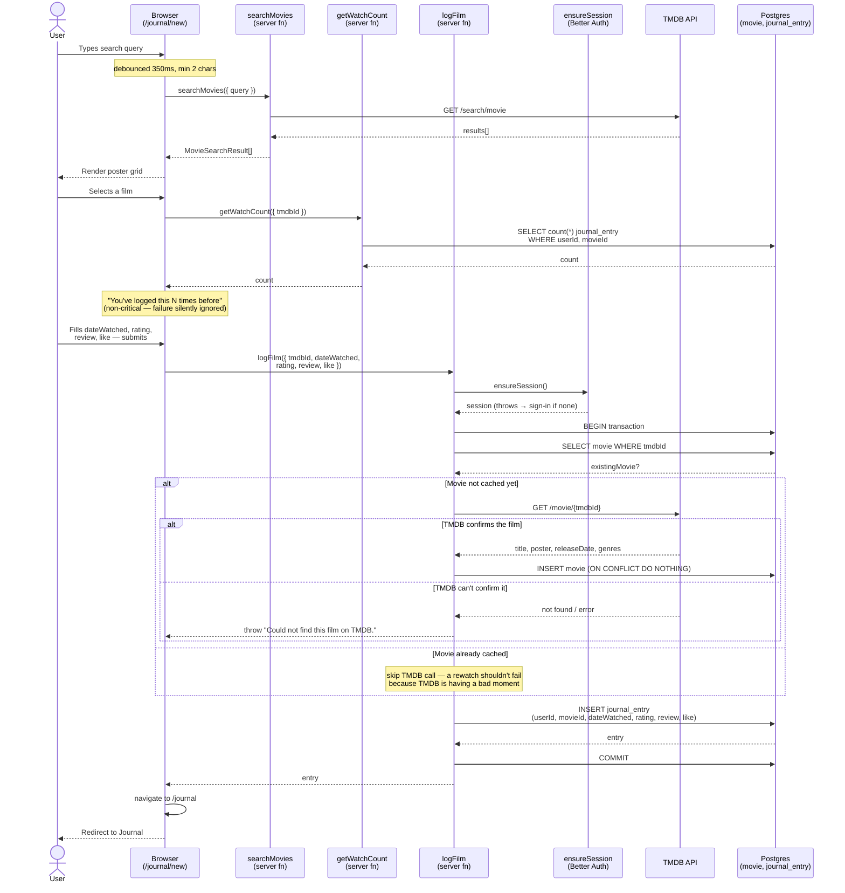

# Sequence: Log a film

Traces `/journal/new` (`src/routes/_authed.journal_.new.tsx`) end to end: TMDB search,
optional rewatch notice, then the `logFilm` server function
(`src/lib/journal/log-film.ts`) that writes `Movie` and `JournalEntry` together.

## Notes

- **Two separate TMDB calls, two separate purposes**: `searchMovies` (client-triggered,
  as the user types) only needs title/poster/release year to render the picker.
  `fetchMovieSummary` (server-triggered, at submit time) fetches the fuller record that
  gets persisted — client-supplied search-result fields are never trusted directly into
  the `Movie` cache (ADR 0005).
- **Movie is written once, on submit — not on selection.** Picking a search result
  doesn't touch the database; `Movie` is immutable and created only inside the
  `logFilm` transaction, and only if it isn't already cached (see CONTEXT.md > Movie,
  ADR 0001).
- **Rewatches skip TMDB entirely.** If `Movie` is already cached, `logFilm` never calls
  TMDB — so logging a rewatch can't fail due to a TMDB outage.
- **`Movie` + `JournalEntry` are written in one transaction**, so a failure fetching or
  inserting the `Movie` row can't leave an orphaned `JournalEntry` (or vice versa).
- **The one specific TMDB error message shown to the user** — "Could not find this
  film on TMDB." — is deliberately narrow; any other failure surfaces a generic message
  so internal errors don't leak (`_authed.journal_.new.tsx`).
- **`getWatchCount` is best-effort**: it only powers the "you've logged this N times
  before" notice, so its failure is swallowed client-side rather than blocking the form.
