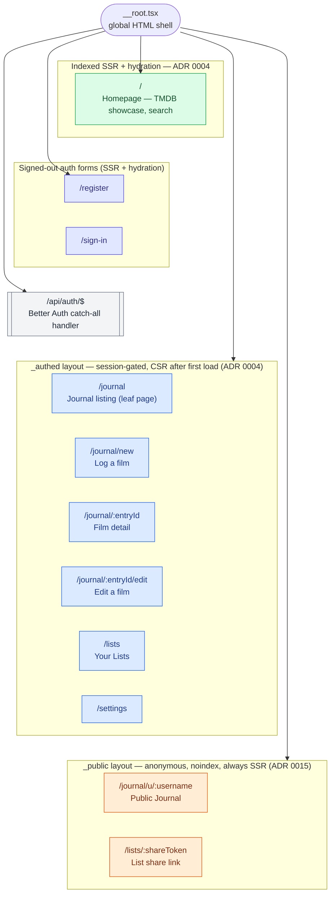

# Route tree

Every route under `src/routes/`, grouped by which of the three rendering categories
(ADR 0004, ADR 0015) it belongs to — complementing the system-design diagram, which
groups by rendering strategy rather than URL shape.

## Notes

- **`/journal/new`, `/journal/:entryId`, and `/journal/:entryId/edit` don't nest under
  `/journal`'s component**, despite the path shape suggesting otherwise. `journal.tsx`
  is a leaf page (a loader-driven listing, no `<Outlet/>`), so the sibling files use
  TanStack Router's trailing-underscore filename convention
  (`_authed.journal_.$entryId.tsx`, etc.) to claim those paths without requiring a
  shared parent layout. All four still sit under `_authed`, so they still get the
  session gate and the site header/nav shell.
- **Three rendering categories, not two** (ADR 0004 originally drew two; ADR 0015 added
  the third): the indexed homepage is the only page SEO cares about; `_authed/*` trades
  indexing for an app-like CSR experience once past the first load; `_public/*` needs
  SSR (so a shared link works without JS and unfurls correctly) but is deliberately
  `noindex` and carries no owner/visitor distinction.
- **`/register` and `/sign-in` aren't inside either shell** — they're top-level routes
  rendered before a session exists, so they can't sit under `_authed` (which requires
  one) or `_public` (reserved for the anonymous List-share / Public-Journal pages).
- **`/api/auth/$` isn't a page at all** — a catch-all route whose `GET`/`POST` handlers
  forward every request straight to `auth.handler` (see the auth/session sequence
  diagram).
- **The Public Journal path is `/journal/u/:username`**, not the bare `/journal/:username`
  ADR 0015 originally specified. ADR 0016 amends that choice: the plain
  `_authed.journal_.$entryId.tsx` route already occupies the same one-segment shape
  under `/journal`, and TanStack Router has no way to prefer one dynamic route over
  another of equal specificity — the authed entry-detail route always won, leaving the
  public route unreachable. The static `u` segment resolves the collision while keeping
  ADR 0015's original reasoning (confine collision risk to the `/journal` prefix).
