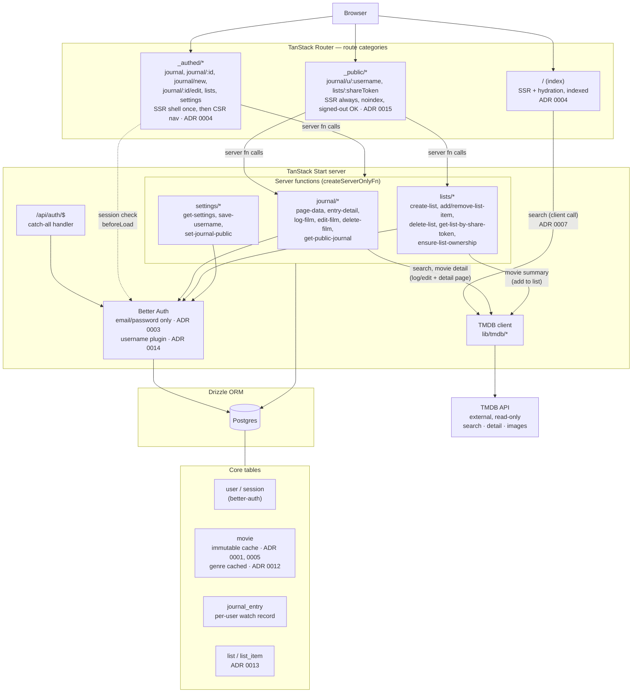

# System Design

High-level architecture of Movie Journal — a TanStack Start monolith (SSR + client-side
server functions) backed by Postgres, with TMDB as the sole external dependency. See
`docs/SYSTEM-DESIGN.md` for requirements and `docs/adr/` for the decisions behind the
choices below.

## Notes

- **Product architecture**: a single TanStack Start monolith — no separate backend/API
  service. Server functions replace REST endpoints (`docs/SYSTEM-DESIGN.md`).
- **Rendering split** (three categories, not two): indexed public SSR homepage, an
  authenticated CSR-shell app (SSR'd once, then client-side navigation), and a third
  `noindex` SSR category for anonymous, always-live public pages — List share links and
  Public Journal (ADR 0004, ADR 0015).
- **Auth**: Better Auth, email/password only (ADR 0003), mounted as a catch-all route
  handler at `/api/auth/$`, backed by the same Postgres database via the Drizzle adapter.
  The `username` plugin backs Username / Public Journal (ADR 0014).
- **Data model**: `Movie` is an immutable TMDB snapshot cached at add-time and keyed by
  TMDB id (ADR 0001); `JournalEntry` is the mutable per-user watch record referencing it;
  `List`/`ListItem` are a separate, watch-data-free collection (ADR 0013). Deleting a
  `JournalEntry` never removes its `Movie` cache row (ADR 0010).
- **TMDB**: the only external dependency — read-only, used for search and catalog/detail
  data. The homepage search calls it directly from the client (ADR 0007); server
  functions call it server-side when logging a film, viewing a detail page, or adding to
  a list.
